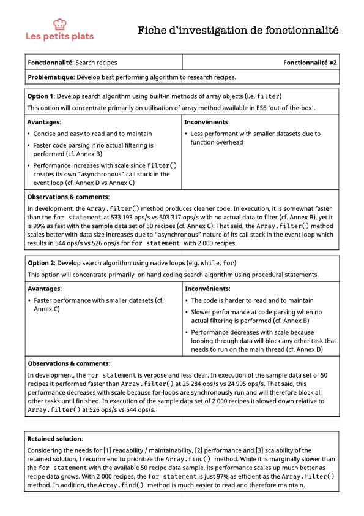
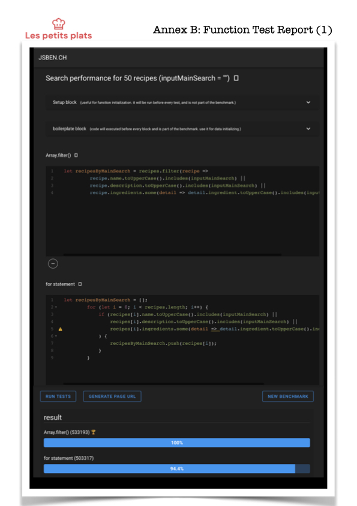
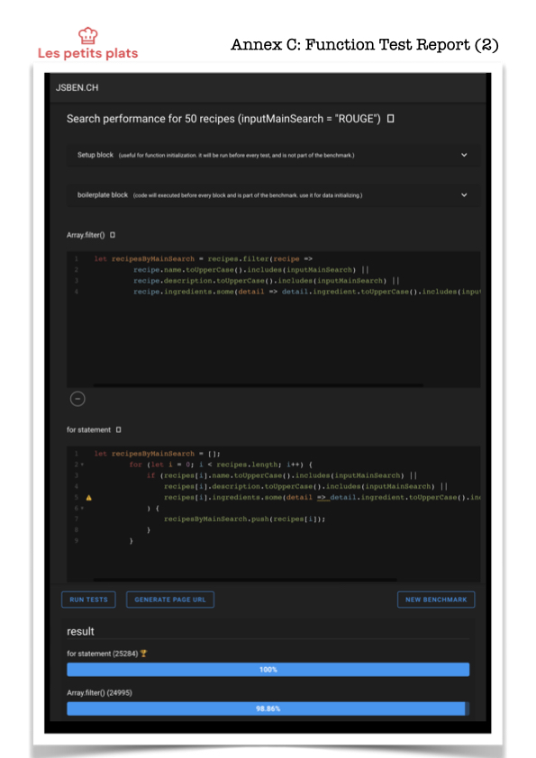

# OpenClassrooms 
Work to deliver the following:

## Project
007 - Développez un algorithme de recherche en JavaScript

## Path 
Développeur d'application - JavaScript React

## Path 
Développeur d'application - JavaScript React

## About this branch
This branch implements research algorithm using JavaScript's built-in ``Array`` object and its ``filter()`` method . 

## Fiche d’investigation de fonctionnalité

Download [Fiche d’investigation de fonctionnalité](assets/pdf/fiche-investigation.pdf)